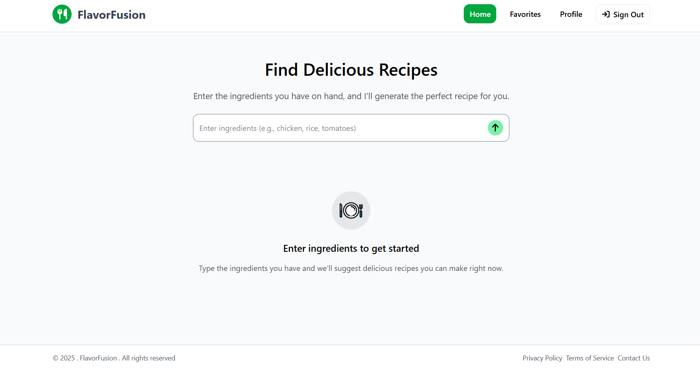

# 🍽️ Flavor Fusion


Flavor Fusion is an **AI-powered** recipe generator web app that creates recipes based on ingredients or dish names entered by the user. It supports saving, deleting, and tracking recipes for each user.

> This is an ongoing project. More features and refinements are being added regularly.


## ✨ Features

1. AI-generated recipes using OpenAI
2. Search by ingredients or recipe name
3. Save your favorite recipes
4. Remove recipes from favorites
5. Image support via Pixabay API
6. Google login via NextAuth
7. Fast performance and modern UI

## 🚀 Live Demo

Check out the live version here: [Flavor Fusion Web-App](https://flavor-fusion-ai.vercel.app)

## 🛠️ Tech Stack
<div>
  
  
  
</div>
  <br>
  
- NextAuth - for authentication
- Openrouter.ai API
- Pixabay API
- Vercel - Deployement


## 🔐 Authentication
Users must Sign in with their Google account to generate and manage recipes. Each user's data (saved recipes, etc.) is securely stored and accessed only by them.

## 📦 Dependencies
### Core Dependencies:
- next
- react & react-dom
- next-auth – Authentication via Google Sign-In
- mongoose & mongodb – MongoDB object modeling and database access
- uuid

### UI & Visualization:
- framer-motion – Animations and transitions
- recharts – Charting library for future visual data

## 🏗️ Build & Deploy

This app is deployed via Railway.

To deploy or build your own:
1. Clone the repo
2. Set environment variables (.env file) for:
- OpenRouter or OpenAI API key
- Pixabay API key
- MongoDB URI
- NextAuth credentials (Google Client ID/Secret)
3. Install dependencies
```bash
npm install
```
4. Run locally
```bash
npm run dev
```
5.Deploy
- Check your code for build errors
```bash
npm run build
```
- Push to GitHub and link your Railway project
- Set the environment variables in Railway dashboard
- Railway handles build and deployment automatically

## 📸 Screenshot


## 🤝 Contributing
Feel free to fork the repo and submit PRs or issues. Contributions are welcome!

## 📄 License
MIT License
